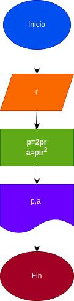

# Programa#1
Programa para calcular el area y el perimetro de un circulo de radio r

# Analisis

## Input 
### Varriables de entrada
r: Radio de el circulo
### Processing
p: perimetro de el circulo
p=2πr

a= area de el circulo
a=πrr

### outpout
a,p
# Diseño

# Construccion 
